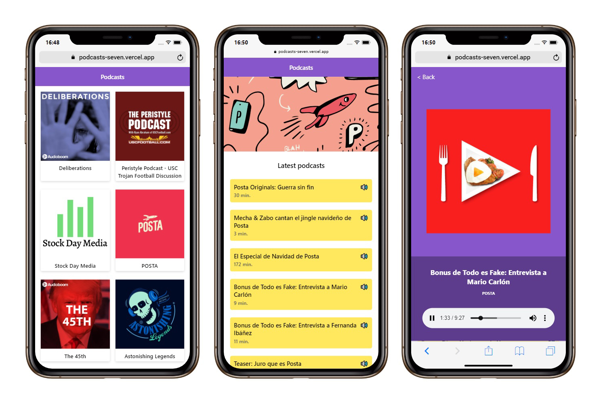

# Podcasts App :iphone: :computer:

Project from Next.js course integrated with AudioBoom API. 

## How does it work? :hammer_and_wrench:

Requiere Node.JS

* `npm install` to install the dependencies. 
* `npm run dev` to run the development environment. 
* `npm run build` to builds the production application. 
* `npm start` to starts a Node.js server. 

## License
MIT 

## Author :black_nib:
[Nicolás Cappabianca]: https://www.linkedin.com/in/nicolascappabianca/